# 🐾 Wildlife Species Detection using Night-Vision Camera Trap Media
<p align="center">
  
  
  
  
  
  
  
</p>


<div align="center">
  
</div>

## 📚 Table of Contents

- [📌 Introduction](#-introduction)
- [📌 What the Project Does](#-what-the-project-does)
- [🌟 Why the Project is Useful](#-why-the-project-is-useful)
- [🚀 How Users Can Get Started with the Project](#-how-users-can-get-started-with-the-project)
  - [📦 Step 1: Preparing the Dataset](#-step-1-preparing-the-dataset)
  - [🔄 Step 2: Converting XML to YOLO Format](#-step-2-converting-xml-to-yolo-format)
  - [🗂 Step 3: Organize Dataset into Training, Validation, and Test Sets](#-step-3-organize-dataset-into-training-validation-and-test-sets)
  - [📝 Step 4: Create YAML Files for YOLO Training](#-step-4-create-yaml-files-for-yolo-training)
  - [🎯 Step 5: Training and Evaluating the YOLO Models](#-step-5-training-and-evaluating-the-yolo-models)
- [📁 Structure of the Project](#structure-of-the-project)
- [📊 Results](#results)
  - [🌞 YOLOv11 - Day Model Evaluation](#-yolov11---day-model-evaluation)
  - [🌙 YOLOv11 - Night Model Evaluation](#-yolov11---night-model-evaluation)
  - [🌞 YOLOv12 - Day Model Evaluation](#-yolov12---day-model-evaluation)
  - [🌙 YOLOv12 - Night Model Evaluation](#-yolov12---night-model-evaluation)
- [🧪 YOLOv11 vs YOLOv12 Prediction on Test Images](#-yolov11-vs-yolov12-prediction-on-test-images)
- [🧪 YOLOv11 vs YOLOv12 Prediction on Web Images](#-yolov11-vs-yolov12-prediction-on-web-images)
- [🎥 YOLOv11 vs YOLOv12 Video Detection Comparison](#-yolov11-vs-yolov12-video-detection-comparison)
- [📜 Project Poster](#-project-poster)
- [📚 References](#-references)
- [👥 Project Authors](#-project-authors)

---

## 📌 Introduction
Accurate identification of animal species is a critical component for wildlife monitoring. Camera traps are used a lot for this, especially those equipped with night-vision capabilities. These cameras take pictures even in the dark. However, these night-time images suffer challenges such as poor illumination, motion blur, etc., making manual species identification difficult.

This project aims to develop a machine learning model capable of detecting and classifying six different animal species from night-vision camera trap images and videos. The goal is to build a model that mimics the human ability to recognize animals even under difficult visual conditions.

We will utilize YOLO (You Only Look Once) algorithm, an objection detection model which is known for its real-time processing speed and high accuracy. Specifically we will use both Yolo11 and Yolo12. It is also well suited for complex background, which is also present in wildlife images.

---

## 📌 What the Project Does

This project focuses on the **automated detection and classification of wildlife species** captured using **night-vision camera traps**, using the **YOLO (You Only Look Once)** object detection algorithm. The system is trained to identify **six animal species** (or more, depending on your selection) in challenging visual environments, particularly during night time when traditional image clarity is compromised.

We have taken AmurLeopard, AmurTiger, LeopardCat, RedFox, Weasel, WildBoar for training and testing.

By training a **custom YOLOv11/YOLOv12 model** on annotated wildlife images, this project enables real-time animal detection with high **precision** and **recall** in both day and night settings.

---

## 🌟 Why the Project is Useful

- 🦊 **Wildlife Monitoring**: Automatically processes thousands of images, reducing the need for manual species identification.
- 🌍 **Conservation Efforts**: Helps in the timely monitoring of endangered or invasive species.
- ⚡ **Speed & Accuracy**: YOLO delivers real-time object detection with high accuracy in complex, cluttered backgrounds.
- 🌙 **Low-Light Adaptation**: Specifically fine-tuned to work with poor illumination and motion blur in night-time images.
- 🎥 **Video Detection**: Helps in detecting the species from video which further can be used for live monitoring.

---

## 🚀 How Users Can Get Started with the Project

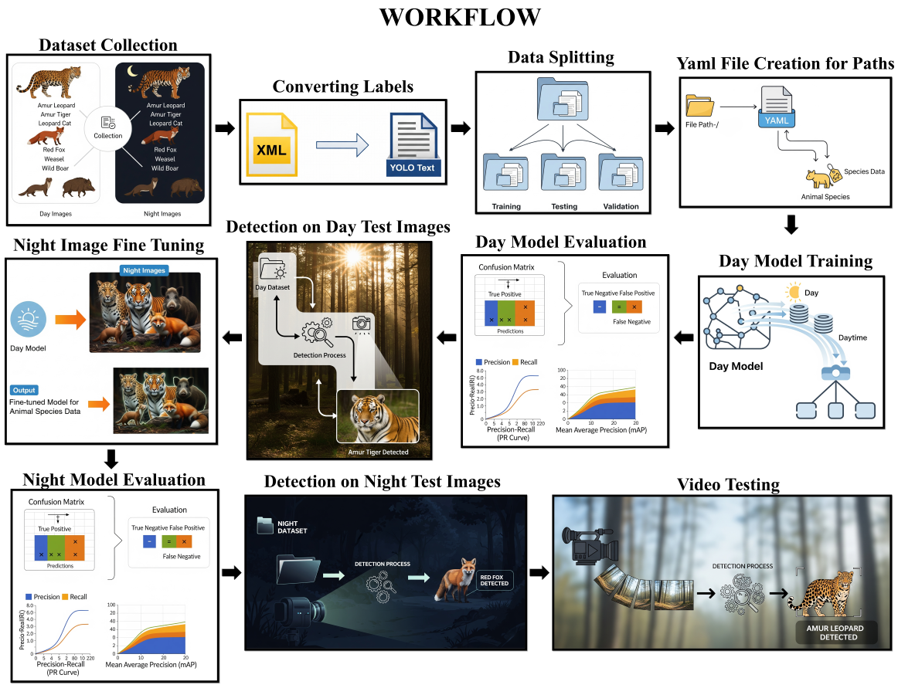

## 📦 Step 1: Preparing the Dataset

- 📥 Download the dataset from the following link:👉 https://github.com/myyyyw/NTLNP
- Follow the instructions in the repository link to download the dataset.
- The downloaded file will contain two folders:
  
  ├── 📁 voc_day
  
  └──  📁 voc_night

- Each of these folders should have the following structure:

  ├── 📁 JPEGImages  (Contains image files (.jpg))
  
  └── 📁 Annotations (Contains bounding box annotations in Pascal VOC (.xml) format)

- Now create a new separate folder for this project. Inside it follow the same folder format:

  - 📁 Day
  
     - 📁 JPEGImages
   
     - 📁 Annotations
  
  - 📁 Night
  
     - 📁 JPEGImages
   
     - 📁 Annotations

- 🐾 There are a total of 17 species in the downloaded dataset. You can select any number of species you want from voc_day and voc_night and store JPEGImages and Annotations in Day and Night folders respectively.
- 📌 Make sure to correctly store the image and its respective annotation.
-  If you're using your own images, follow the same folder format.

## 🔄 Step 2: Converting XML to YOLO Format

YOLO requires annotations in `.txt` format, and for our images we have annotations in `PASCAL VOC (.xml format)`. A conversion script (`script.py`) is provided in this repository, which converts the annotations to the required `.txt` format.

Before running the script:
- Open `script.py` and modify the `species` list to include the names of only those species you want to include in your model.

### 🔧 Instructions:

1. Place `script.py` in the same folder where `Annotations/` and `JPEGImages/` are located.
2. Open a terminal in that folder.
3. Run the script using the following command:

```bash
python script.py
```

Do this for both Day and Night. This will generate a new folder called `labels` that contains YOLO-compatible `.txt` annotation files.

## 🗂 Step 3: Organize Dataset into Training, Validation, and Test Sets

Now open the terminal in the main project location and open jupyter notebook from the following command:

```
jupyter notebook
```

Create a new ipynb file and paste the code given in `dataset_split.ipynb` or you can directly use this file given in the repository through jupyter notebook. This script automates the process of:
- Splitting your Day and Night datasets into **training**, **validation**, and **test** sets.
- The split ratio is **70%** training, **15%** validation and **15%** test.
- Organizing images and labels into the required YOLO format folder structure.

Make sure that this ipynb file is present in the same location as of the datasets. Also, change the species list given in the code as required.

### What the script does:

- Takes images and corresponding `.txt` labels from the original `Day` and `Night` folders.
- Creates two new folders:  
  - 📁 dataset_day
  - 📁 dataset_night

Each contains the following subfolders:
- 📁 images
  - 📁 train
  - 📁 val
  - 📁 test
- 📁 labels
  - 📁 train
  - 📁 val
  - 📁 test

## 📝 Step 4: Create YAML Files for YOLO Training

To train a YOLO model using the Ultralytics framework, you need a `.yaml` file that defines:

- The paths to your training and validation datasets
- The list of species (classes) you're training on

YAML files act as **configuration files** that tell YOLO where your data is and what to label.

### 📂 Files Already Provided

Two YAML files are already included in this repository:
- `dataset_day.yaml`
- `dataset_night.yaml`

You can use these as templates and **edit them as needed**. Make sure to store these files in the same location where the dataset folders are located. Dont put them inside the dataset folders.

### 🧠 What to Update

1. **Species List (Class Names):**  
   Update the `names:` section to match the exact species you're training on.  
   Example:
   ```yaml
   names:
     0: AmurLeopard
     1: AmurTiger
     2: LeopardCat
     3: RedFox
     4: Weasel
     5: WildBoar

2. Label Index Must Match Text Files:
   - The index numbers (0, 1, 2...) must match the first number in each line of your .txt label
   files.
   - For example, if a label file starts with 2 0.56 0.33 0.25 0.18, it corresponds to the
   species at index 2 in the YAML file (LeopardCat in this case).
   - Make sure to check the index number of each species in one of their label files and update it in the yaml file.

## 🎯 Step 5: Training and Evaluating the YOLO Models

To train and evaluate your YOLO models, four Jupyter Notebook files have been provided in this repository:

- `yolo11_day.ipynb`
- `yolo11_night.ipynb`
- `yolo12_day.ipynb`
- `yolo12_night.ipynb`

These notebooks contain the full pipeline for:
- Training on the `Day` dataset
- Fine-tuning on the `Night` dataset
- Evaluating model performance
- Running inference on test images and videos

More instructions are given inside the notebook for model training and evaluation. Make sure to place the notebook files in the same location as of the datasets and run the files in the same order as given above.

Before training your model, it's best practice to set up a virtual environment.

### 📦 Setting Up a Virtual Environment

Using a virtual environment helps isolate project-specific dependencies from your global Python installation. This ensures:

- 🔐 No conflicts between package versions across different projects  
- 🧪 Reproducibility of your code environment  
- 🧹 Clean and manageable development setups  

Follow these steps to create and activate a virtual environment for this project:

#### ✅ Step 1: Create the Virtual Environment

Open your terminal in the project folder. Use the following command to create a virtual environment named `yolov-env`.  
Suppose your project is in the `F:` drive. Then run:

```bash
F:\Project> python -m venv yolov-env
```

This will create a folder named `yolov-env` containing all environment files.

#### ⚙️ Step 2: Activate the Environment

Activate the environment.

```bash
F:\Project\yolov-env\Scripts\activate
```

Once activated, your terminal prompt will show the environment name like this:

```bash
(yolov-env) F:\Project>
```

#### 📚 Step 3: Add the Environment to Jupyter

With the environment active, install the IPython kernel package:

```bash
(yolov-env) F:\Project> pip install ipykernel
```

Then register the environment as a Jupyter kernel:

```bash
(yolov-env) F:\Project> python -m ipykernel install --user --name=yolov-env --display-name "Python (yolov-env)"
```

You can now select **"Python (yolov-env)"** from the kernel options in Jupyter Notebook.

💡 *Tip: To deactivate the environment at any time, just run:*

```bash
deactivate
```

In the same activated environment, open jupyter notebook as given below:

```bash
(yolov-env) F:\Project>jupyter notebook 
```

Once the jupyter notebook opens, you can see the 4 jupyter notebook files for training and evaluation, if you followed all the above steps correctly. Now can you run them.

---

# Structure of the Project

Before starting training the model, your project structure should look like below.

📁 **Project Root**  
├── 📁 Day  
│   ├── 🗂️ Annotations  
│   ├── 🖼️ JPEGImages  
│   ├── 🏷️ labels  
│   └── 📜 script.py  
├── 📁 Night  
│   ├── 🗂️ Annotations  
│   ├── 🖼️ JPEGImages  
│   ├── 🏷️ labels  
│   └── 📜 script.py  
├── 📁 dataset_day  
│   ├── 📁 images  
│   │   ├── 🧪 test  
│   │   ├── 🏋️ train  
│   │   └── ✅ val  
│   ├── 📁 labels  
│   │   ├── 🧪 test  
│   │   ├── 🏋️ train  
│   │   └── ✅ val  
├── 📁 dataset_night  
│   ├── 📁 images  
│   │   ├── 🧪 test  
│   │   ├── 🏋️ train  
│   │   └── ✅ val  
│   ├── 📁 labels  
│   │   ├── 🧪 test  
│   │   ├── 🏋️ train  
│   │   └── ✅ val  
├── 📄 dataset_day.yaml  
├── 📄 dataset_night.yaml  
├── 📓 dataset_split.ipynb  
├── 📓 yolo11_day.ipynb  
├── 📓 yolo11_night.ipynb  
├── 📓 yolo12_day.ipynb  
└── 📓 yolo12_night.ipynb  

---

# Results

### 🌞 YOLOv11 - Day Model Evaluation

| Class         | Images | Instances | Precision | Recall | mAP@0.5 | mAP@0.5:0.95 |
|---------------|--------|-----------|-----------|--------|---------|--------------|
| **All**       | 636    | 649       | 0.989     | 0.982  | 0.991   | 0.860        |
| AmurLeopard   | 106    | 108       | 0.996     | 0.991  | 0.995   | 0.895        |
| AmurTiger     | 106    | 108       | 0.998     | 0.991  | 0.995   | 0.918        |
| LeopardCat    | 106    | 108       | 0.999     | 0.972  | 0.994   | 0.891        |
| RedFox        | 106    | 108       | 0.991     | 0.992  | 0.994   | 0.874        |
| Weasel        | 106    | 109       | 0.981     | 0.962  | 0.991   | 0.729        |
| WildBoar      | 106    | 108       | 0.966     | 0.981  | 0.978   | 0.854        |

**The following can be interpreted from the above table:**
- The model achieves **high precision (0.989)**, **recall (0.982)**, and **mAP@0.5 (0.991)**, reflecting strong detection capability with minimal false positives or negatives.
- At a stricter IoU threshold (**mAP@0.5:0.95 = 0.860**), the model still performs well, demonstrating strong object localization capabilities.
- **Amur Tiger** and **Leopard Cat** are among the best-detected classes with near-perfect scores.
- **Weasel** is the most challenging class, showing slightly lower recall and localization accuracy.
- Overall, the model is balanced and performs robustly across all species.

### 🧩 YOLOv11 Day - Confusion Matrix 
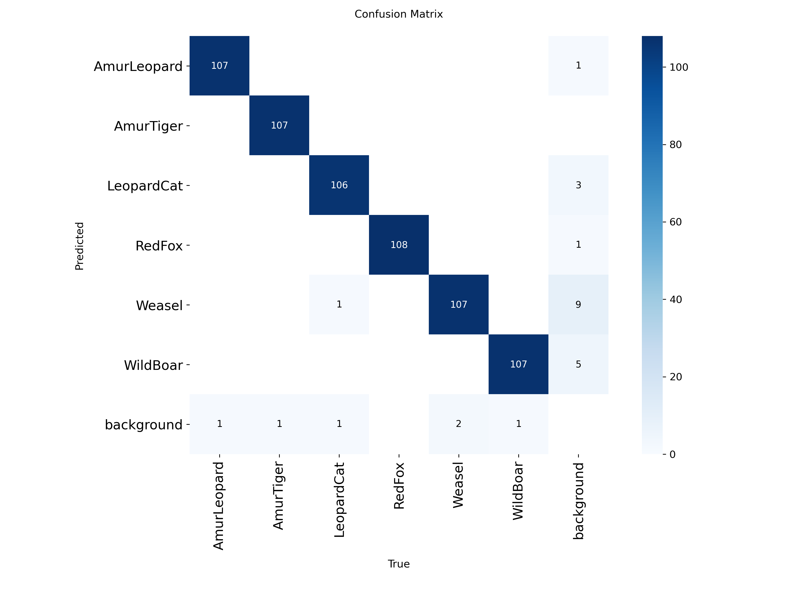

**The following can be interpreted from the above plot:**
- The model correctly classifies nearly all instances for each class, indicated by a strong diagonal.
- Misclassifications are minimal and mostly involve confusion with the **background** class.
- **Weasel** and **LeopardCat** had a few cases misclassified as background.
- A few background samples were incorrectly predicted as animal classes.
- The matrix confirms **high classification strength** and **excellent precision/recall**.

### 📈 YOLOv11 Day - Precision-Recall Curve
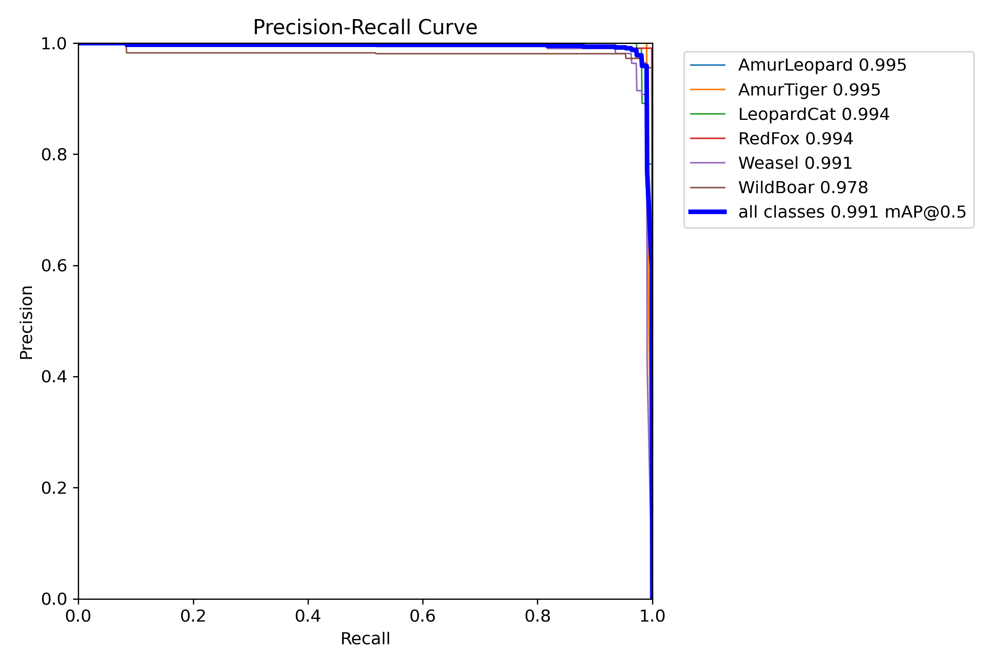

**The following can be interpreted from the above plot:**
- All classes achieve **very high Average Precision (AP)**, with the overall **mAP@0.5 = 0.991**.
- Curves remain near the **top-right corner**, reflecting strong performance in both precision and recall.
- The model demonstrates the ability to detect most objects while minimizing false positives and false negatives.

### 📊 YOLOv11 Day - F1 Score Curve 
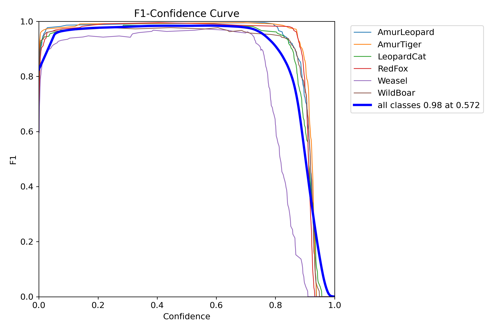

**The following can be interpreted from the above plot:**
- The F1 score peaks at **0.98** at an optimal confidence threshold of **0.572**.
- Most classes maintain **high F1 scores** over a wide range of confidence values.
- **Weasel** and **WildBoar** show slightly more variability, indicating areas for potential improvement.
- The model overall performs consistently and effectively across all thresholds.

### 🌙 YOLOv11 - Night Model Evaluation

| Class         | Images | Instances | Precision | Recall | mAP@0.5 | mAP@0.5:0.95 |
|---------------|--------|-----------|-----------|--------|---------|--------------|
| **All**       | 450    | 453       | 0.972     | 0.971  | 0.989   | 0.852        |
| AmurLeopard   | 75     | 76        | 0.985     | 1.000  | 0.995   | 0.883        |
| AmurTiger     | 75     | 75        | 0.984     | 1.000  | 0.995   | 0.881        |
| LeopardCat    | 75     | 75        | 0.936     | 0.978  | 0.990   | 0.864        |
| RedFox        | 75     | 75        | 0.932     | 0.960  | 0.973   | 0.817        |
| Weasel        | 75     | 75        | 0.996     | 0.920  | 0.989   | 0.801        |
| WildBoar      | 75     | 77        | 1.000     | 0.970  | 0.989   | 0.865        |

**The following can be interpreted from the above table:**
- The model achieves **high precision (0.972)**, **recall (0.971)**, and **mAP@0.5 (0.989)**, indicating reliable detection with minimal errors.  
- At a stricter IoU threshold (**mAP@0.5:0.95 = 0.852**), the model maintains good localization performance, showing robustness under challenging conditions.  
- **Amur Leopard** and **Amur Tiger** achieve **perfect recall (1.000)** and **very high precision (0.985 & 0.984)**, making them the best-performing classes.  
- **Weasel** shows the lowest recall (0.920) and mAP@0.5:0.95 (0.801), suggesting it’s the most difficult class to detect reliably at night.  
- Despite nighttime conditions, the model shows **balanced and reliable performance** across all species.

### 🧩 YOLOv11 Night - Confusion Matrix 
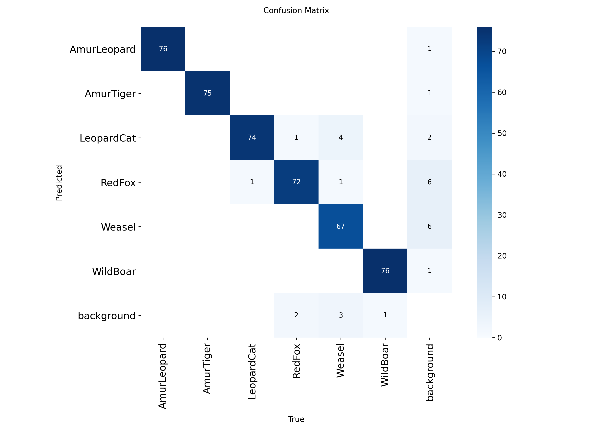

**The following can be interpreted from the above plot:**
- The model correctly classifies nearly all instances, indicated by a strong diagonal in the matrix.  
- **Amur Leopard**, **Amur Tiger**, and **WildBoar** show **perfect or near-perfect predictions** with no significant confusion.  
- **LeopardCat** had minor confusion with **RedFox** and **background**, reinforcing its lower recall.
- **Weasel** had 6 misclassifications with **background**, also reinforcing its lower recall.  
- There are a few false positives for animal classes from background, which is expected in low-light scenarios.  
- Overall, the matrix reflects **strong classification performance**, even under more difficult night settings.

### 📈 YOLOv11 Night - Precision-Recall Curve
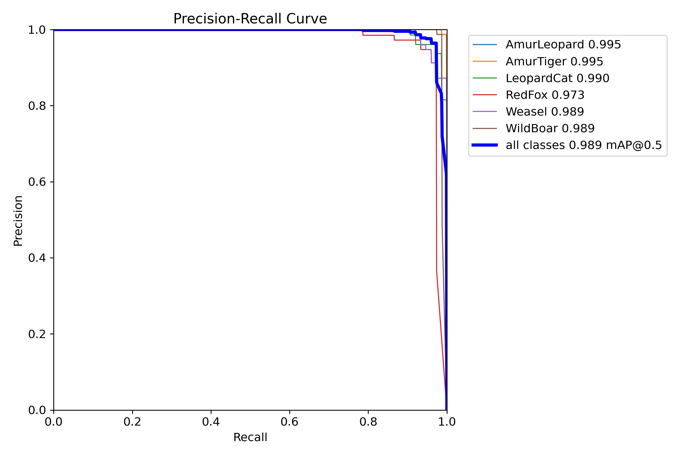

**The following can be interpreted from the above plot:**
- All classes show **high Average Precision**, especially **AmurLeopard** and **AmurTiger** with **0.995 AP**, matching the tabular mAP@0.5.  
- The curves cluster near the **top-right**, suggesting the model achieves **high precision and recall** across species.  
- **RedFox** and **Weasel** show slightly lower AP (0.973 and 0.989), indicating marginally more challenging detections.  
- Overall **mAP@0.5 = 0.989**, confirming excellent detection capability at night.

### 📊 YOLOv11 Night - F1 Score Curve 
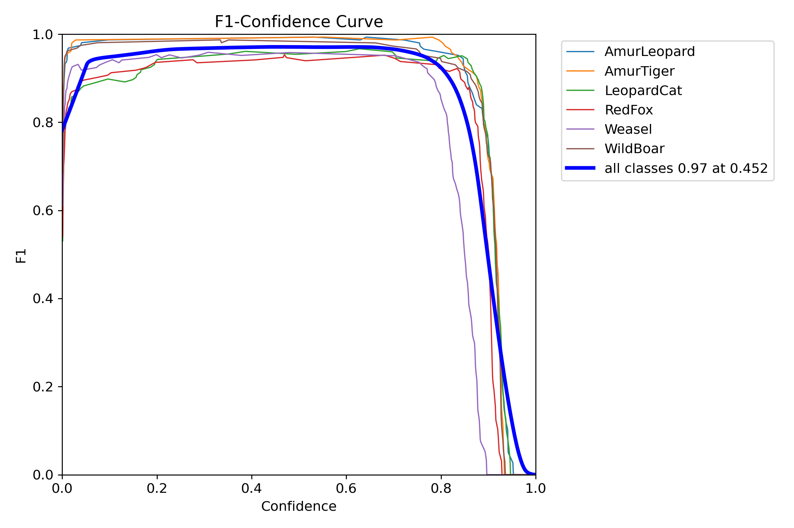

**The following can be interpreted from the above plot:**
- The F1 score peaks at **0.97** at an optimal confidence threshold of **0.452**, balancing precision and recall.  
- Most classes, including **AmurLeopard**, **AmurTiger**, and **LeopardCat**, maintain **F1 > 0.95** across a wide range.  
- **Weasel** and **RedFox** show slightly more variation, likely due to background confusion, as seen in the confusion matrix.  
- The overall curve suggests that the model is **reliable across varying confidence thresholds**, with excellent performance even under night-time conditions.

### 🌞 YOLOv12 - Day Model Evaluation

| Class         | Images | Instances | Box(P) | R     | mAP50 | mAP50-95 |
|---------------|--------|-----------|--------|-------|--------|-----------|
| all           | 636    | 649       | 0.984  | 0.973 | 0.991  | 0.857     |
| AmurLeopard   | 106    | 108       | 0.996  | 0.991 | 0.995  | 0.888     |
| AmurTiger     | 106    | 108       | 0.991  | 0.981 | 0.989  | 0.916     |
| LeopardCat    | 106    | 108       | 0.972  | 0.965 | 0.992  | 0.883     |
| RedFox        | 106    | 108       | 0.988  | 1.000 | 0.995  | 0.877     |
| Weasel        | 106    | 109       | 0.981  | 0.946 | 0.985  | 0.735     |
| WildBoar      | 106    | 108       | 0.973  | 0.954 | 0.987  | 0.842     |

**The following can be interpreted from the above table:**
- The model achieves **high precision (0.984)**, **recall (0.973)**, and **mAP@0.5 (0.991)**, indicating accurate and consistent object detection with minimal false positives or negatives.
- At a stricter IoU threshold (**mAP@0.5:0.95 = 0.857**), the model still performs well, showing strong object localization capabilities.
- **Amur Tiger (mAP50: 0.989, mAP50-95: 0.916)** and **Leopard Cat (mAP50: 0.992, mAP50-95: 0.883)** are among the best-detected classes with near-perfect scores.
- **Weasel** is the most challenging class, with slightly lower recall (0.946) and localization accuracy (mAP50-95: 0.735).
- Overall, the model is **well-balanced and robust** across all species, with high performance maintained on every class.

### 🧩 YOLOv12 Day - Confusion Matrix 
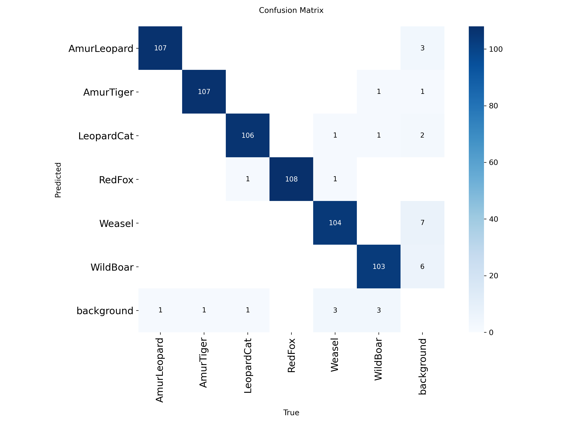

**The following can be interpreted from the above plot:**
- The model accurately classifies nearly all instances, as indicated by the **strong diagonal values**.
- Misclassifications are **minimal and sparse**, primarily involving the **background class** or slight inter-class confusion.
- A small number of background samples were falsely predicted as animal classes.
- **Weasel and WildBoar** show the highest number of off-diagonal misclassifications but still maintain strong overall performance.
- The matrix confirms **excellent class separability**, with the model handling multi-class prediction very effectively.

### 📈 YOLOv12 Day - Precision-Recall Curve
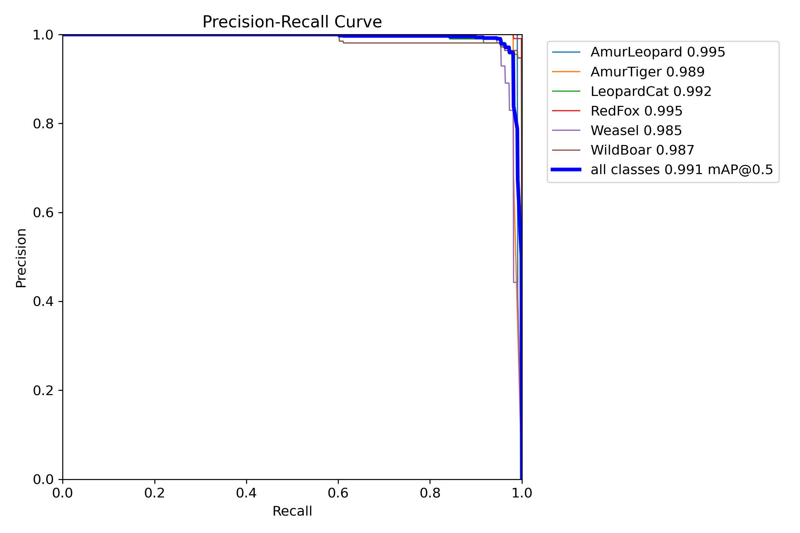

**The following can be interpreted from the above plot:**
- All classes exhibit **very high average precision**, demonstrating excellent object detection performance across species.
- The precision-recall curves are tightly clustered in the **top-right region**, indicating consistently strong recall and precision.
- The model effectively **balances detection capability and robustness**, successfully minimizing both false positives and false negatives.
- This consistency suggests the model is highly reliable for **real-world deployment and wildlife monitoring applications**.

### 📊 YOLOv12 Day - F1 Score Curve 
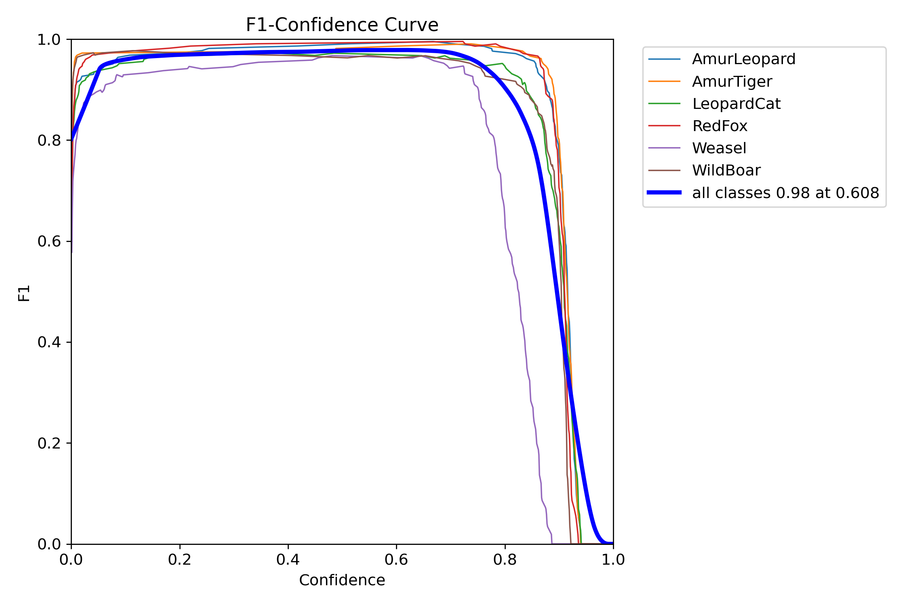

**The following can be interpreted from the above plot:**
- The F1 score peaks at **0.98** at an optimal confidence threshold of **0.608**.
- Most classes maintain **F1 scores above 0.95** across a wide confidence range.
- **Weasel** and **WildBoar** show slightly more variation in F1 with changing confidence, suggesting room for improvement in stability.
- The **thick blue line** summarizing all classes confirms overall robustness and helps in selecting a good confidence threshold for deployment.

### 🌙 YOLOv12 - Night Model Evaluation

| Class         | Images | Instances | Box(P) | R     | mAP50 | mAP50-95 |
|---------------|--------|-----------|--------|-------|--------|-----------|
| all           | 450    | 453       | 0.990  | 0.962 | 0.988  | 0.854     |
| AmurLeopard   | 75     | 76        | 0.993  | 1.000 | 0.995  | 0.886     |
| AmurTiger     | 75     | 75        | 0.998  | 1.000 | 0.995  | 0.891     |
| LeopardCat    | 75     | 75        | 0.977  | 0.973 | 0.994  | 0.879     |
| RedFox        | 75     | 75        | 0.986  | 0.942 | 0.972  | 0.797     |
| Weasel        | 75     | 75        | 0.985  | 0.897 | 0.983  | 0.794     |
| WildBoar      | 75     | 77        | 1.000  | 0.963 | 0.988  | 0.879     |

**The following can be interpreted from the above table:**
- The model demonstrates **high precision (0.990)** and **mAP@0.5 (0.988)**, indicating accurate object detection. **Recall is also strong at 0.962**.
- At a stricter IoU threshold (**mAP@0.5:0.95 = 0.854**), the model maintains good performance, showing **robust localization even under challenging night conditions**.
- **Amur Leopard**, **Amur Tiger**, and **Wild Boar** show **exceptional performance**, with very high precision, recall, and mAP scores.
- **Red Fox** and **Weasel** are comparatively more challenging, particularly in recall and localization, suggesting **more false negatives or reduced precision** for these classes.
- Overall, the model performs **very well in night scenarios**, with only slight performance drops for specific classes compared to the top performers.

### 🧩 YOLOv12 Night - Confusion Matrix 


**The following can be interpreted from the above plot:**
- The diagonal values are **consistently strong**, indicating accurate predictions for the majority of instances per class.
- **Misclassifications are minimal**, with some confusion between **Leopard Cat**, **Red Fox**, and **Weasel**, either with each other or the background.
- There are **occasional false positives and false negatives** involving the background, but these are relatively rare.
- The confusion matrix confirms **strong classification performance**, with opportunities for refinement in **differentiating similar or nocturnally camouflaged species**.

### 📈 YOLOv12 Night - Precision-Recall Curve
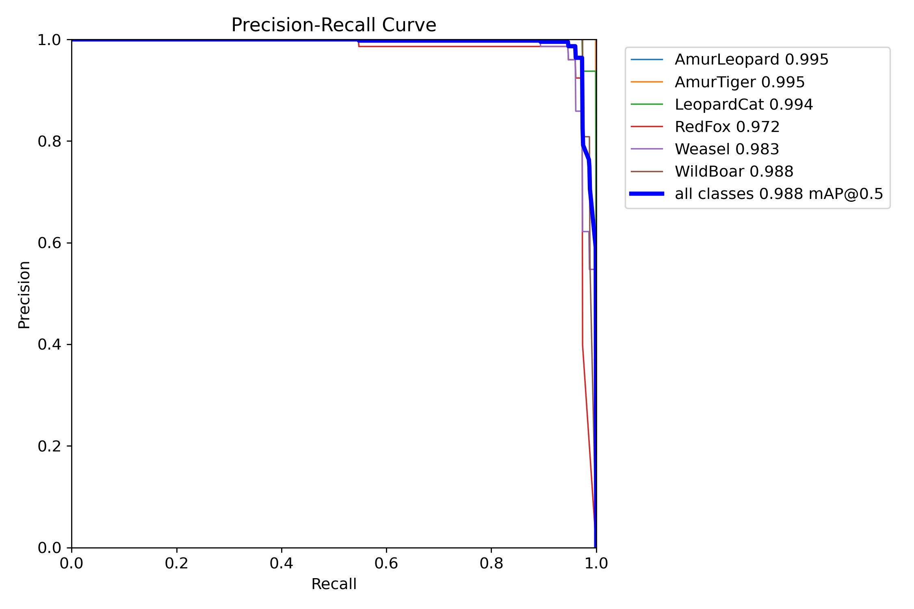

**The following can be interpreted from the above plot:**
- All classes exhibit **very high average precision**, contributing to the strong overall **mAP@0.5 of 0.988**.
- The curves are clustered near the **top-right**, reflecting a good balance between precision and recall.
- The model is **effective at minimizing both false positives and false negatives**.
- **Red Fox** and **Weasel** show relatively lower AP than other classes, indicating **marginally lower confidence or localization performance** in these cases.

### 📊 YOLOv12 Night - F1 Score Curve 
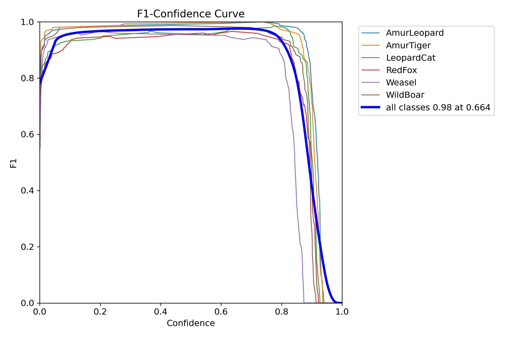

**The following can be interpreted from the above plot:**
- The F1 score **peaks at 0.98** at a confidence threshold of **0.664**.
- Most classes maintain **high F1 scores across a wide range of thresholds**, confirming **stable model performance**.
- **Red Fox** and **Weasel** show more variation in F1 scores at higher thresholds, suggesting **less confidence in predictions** for these classes under night conditions.
- Overall, the model shows **robust F1 performance**, with some room for **improving stability and confidence in difficult-to-detect classes**.

---

## 🧪 YOLOv11 vs YOLOv12 Prediction on Test Images

| 🐾 Species    | 🎯 YOLOv11 Prediction                         | 🎯 YOLOv12 Prediction                        |
|----------------|-----------------------------------------------|-----------------------------------------------|
| AmurLeopard    | 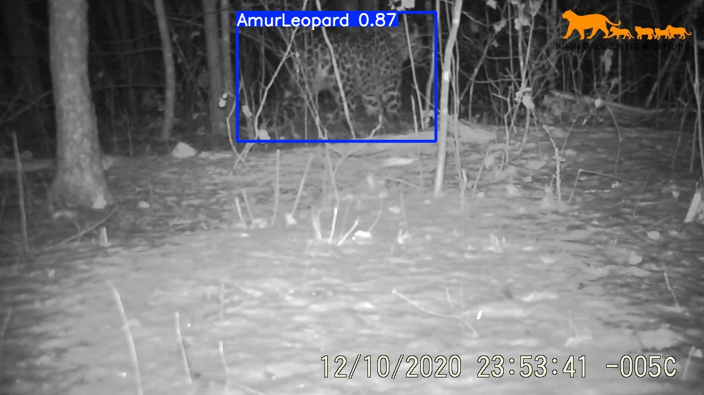 | 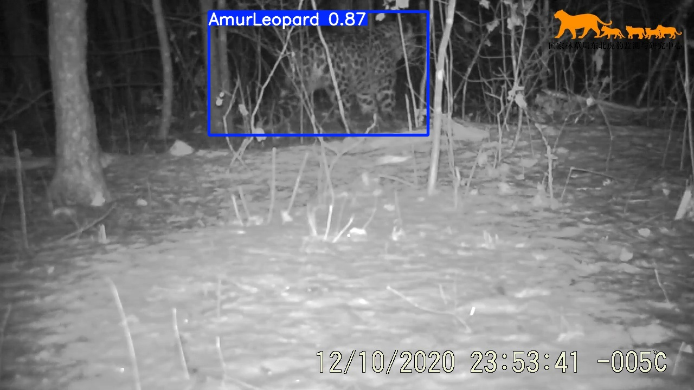 |
| AmurTiger      | 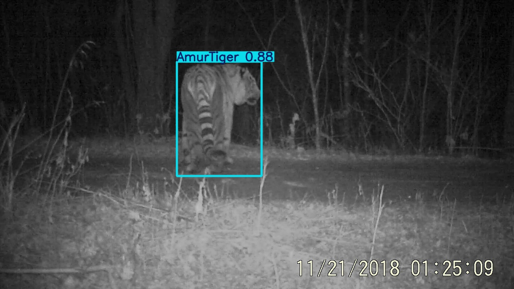   | 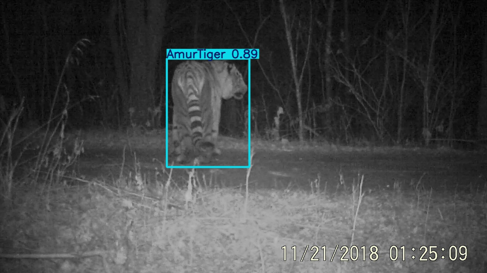   |
| LeopardCat     | 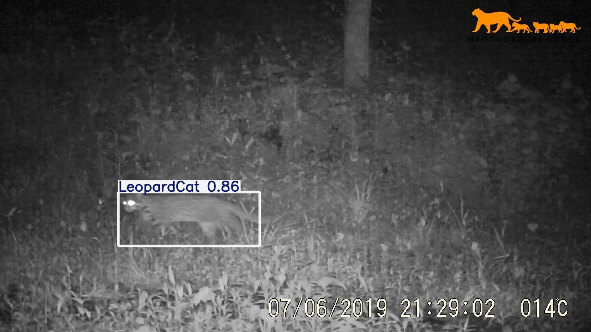 |  |
| RedFox         |          | 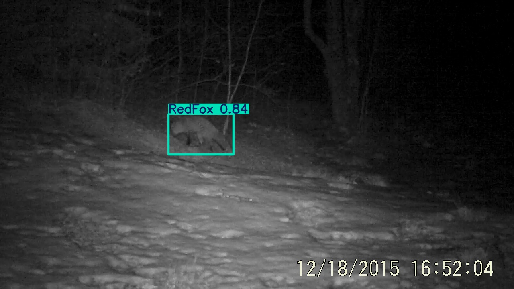         |
| Weasel         |          | 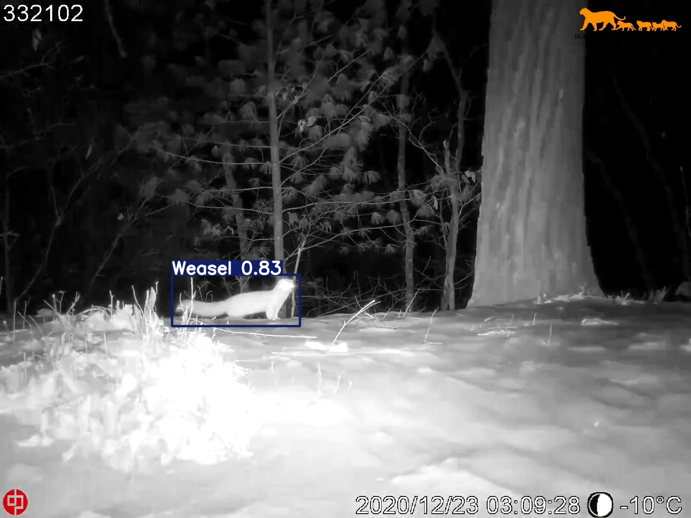         |
| WildBoar       | 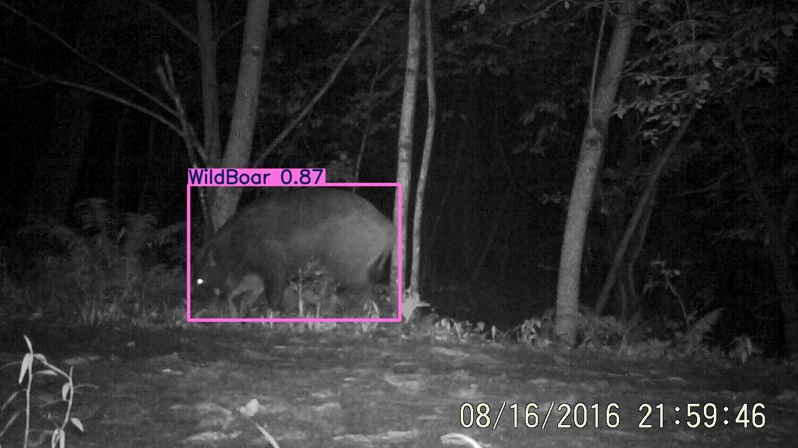     | 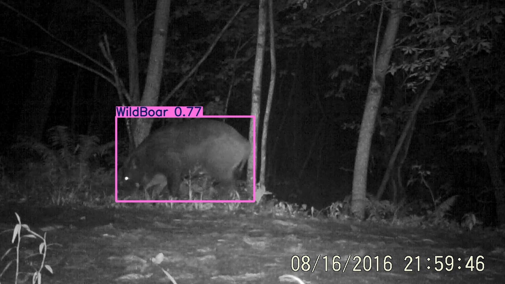     |

**From the above results of performance of the two models, YOLOv11 and YOLOv12, the following can be interpreted:**
- YOLOv11 consistently outperforms or matches YOLOv12 in terms of identification accuracy across six species.  
- Both models performed equally well for **Amur Leopard** and **Weasel**.  
- YOLOv11 slightly fell behind YOLOv12 in identifying **Amur Tiger**.  
- YOLOv11 outperformed YOLOv12 in recognizing **Leopard Cat**, **Red Fox**, and **Wild Boar**.  

Overall, **YOLOv11 demonstrates better consistency and reliability across species**, making it the **preferable model** for wildlife image identification.

---

## 🧪 YOLOv11 vs YOLOv12 Prediction on Web Images

| 🐾 Species     | 🎯 YOLOv11 Prediction                        | 🎯 YOLOv12 Prediction                      |
|----------------|-----------------------------------------------|---------------------------------------------|
| AmurLeopard    |  |  |
| AmurTiger      |    |    |
| LeopardCat     | 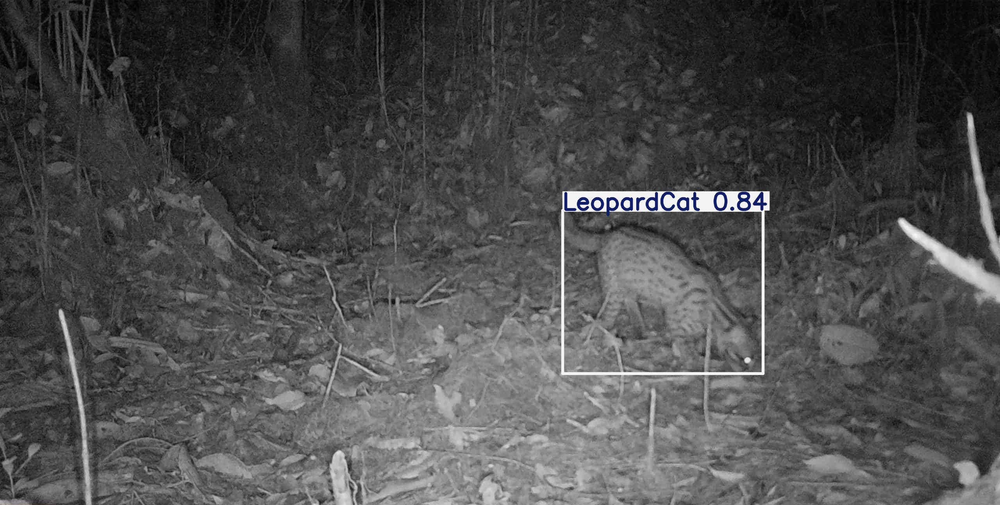 | 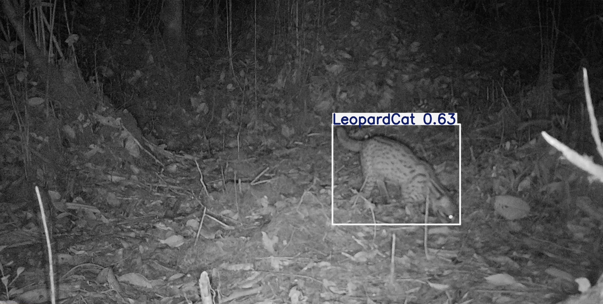 |
| RedFox         |          |          |
| Weasel         |          |          |
| WildBoar       |      |      |

**From the above results of performance of the two models, YOLOv11 and YOLOv12, the following can be interpreted:**
- YOLOv12 performed better in detecting **Amur Leopards** in a multi-object image and **Amur Tiger**.  
- YOLOv11 outperformed YOLOv12 in recognizing **Leopard Cat**, **Weasel**, and **Wild Boar**.  
- YOLOv12 misclassified **Red Fox** as **Wild Boar**, while YOLOv11 correctly identified it.  

Overall, **YOLOv11 demonstrates greater reliability and fewer critical misclassifications across web images**, making it the **more robust choice** for real-world wildlife image identification.

---

## 🎥 YOLOv11 vs YOLOv12 Video Detection Comparison

| **Species**     | **YOLOv11 Detection**                     | **YOLOv12 Detection**                     |
|----------------|-------------------------------------------|-------------------------------------------|
| AmurLeopard    | 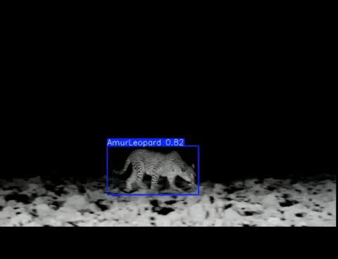            | 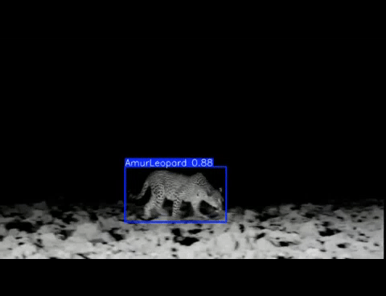            |
| AmurTiger      | 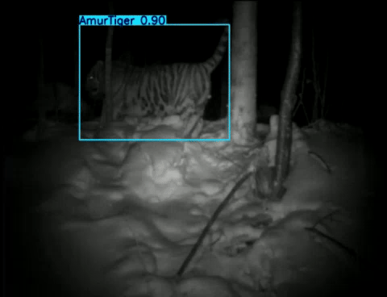              | 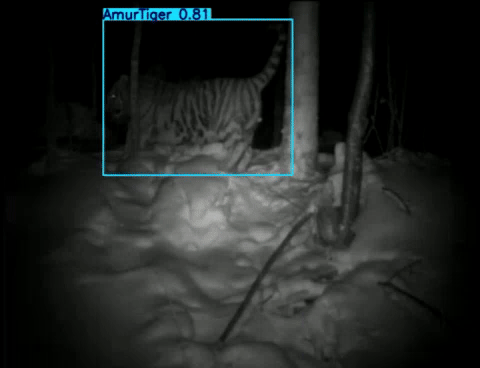              |
| LeopardCat     | 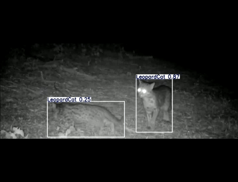             | 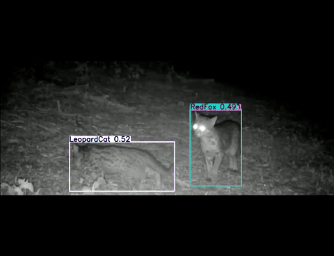             |
| RedFox         | 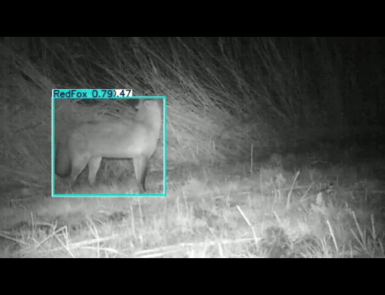                 | 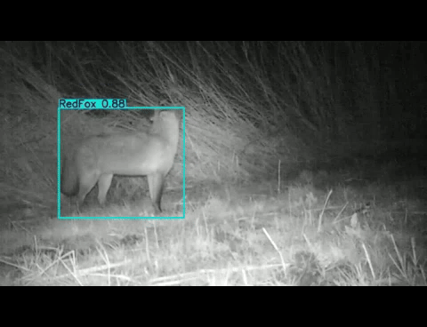                 |
| Weasel         | 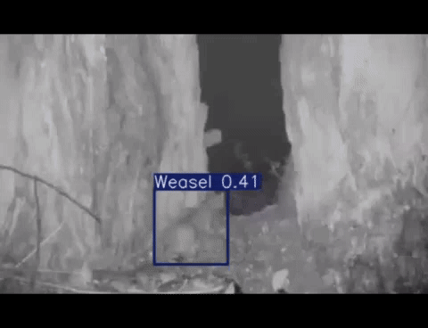                 | 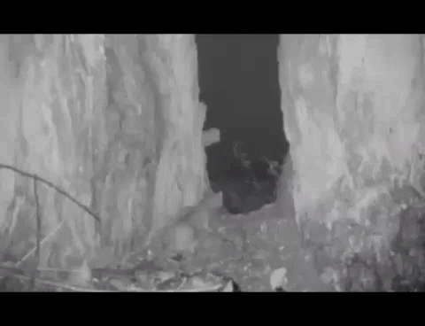                 |
| WildBoar       | 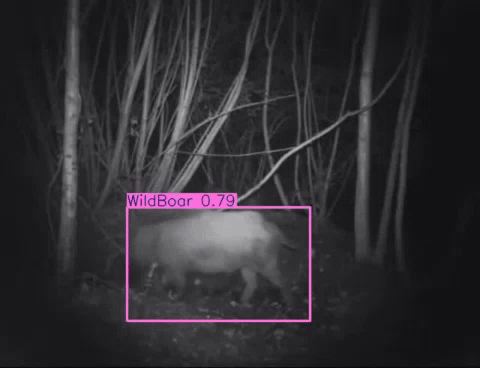               | 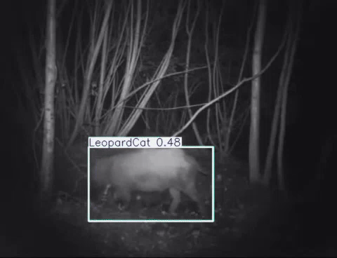               |

**From the above results of performance of the two models, YOLOv11 and YOLOv12, the following can be interpreted:**
- Both **YOLOv11** and **YOLOv12** correctly identified **Amur Leopard** in the video, demonstrating **consistent performance** for this species.  
- **YOLOv11** **correctly identified** the **Amur Tiger**, whereas **YOLOv12** showed **inconsistency** by occasionally **misclassifying** it and even **falsely detecting** the presence of a **Wild Boar** when none was present.  
- **YOLOv11** performed well in identifying the **Leopard Cat**. In contrast, **YOLOv12** often **misclassified** the **Leopard Cat** as either a **Red Fox** or a **Wild Boar**.  
- Both models showed **good performance** in identifying the **Red Fox** correctly from the video.  
- **YOLOv11** correctly detected the **Weasel**, but **YOLOv12** **misclassified** it in some instances, sometimes **falsely detecting** it as an **Amur Tiger**.  
- **YOLOv11** successfully identified the **Wild Boar**. However, **YOLOv12** occasionally **confused** the **Wild Boar** with the **Leopard Cat**.  

Based on the observations above, **YOLOv11 outperforms YOLOv12** in terms of **species identification performance**. **YOLOv11** demonstrates **better consistency** and **fewer misclassifications** across various species.  

---

## 📜 Project Poster

You can download the detailed poster for the project from the link below:

👉 [***Download Here***](Poster.pdf)

---

## 📚 References  

- Dataset: [https://github.com/myyyyw/NTLNP](https://github.com/myyyyw/NTLNP)  
- YOLO Documentation: [https://docs.ultralytics.com/](https://docs.ultralytics.com/)  
- Scott Leorna and Todd Brinkman. *Human vs. machine: Detecting wildlife in camera trap images.* Ecological Informatics, 72:101876, 2022.  
- Aslak Tøn, Ammar Ahmed, Ali Shariq Imran, Mohib Ullah, and R Muhammad Atif Azad. *Metadata augmented deep neural networks for wild animal classification.* Ecological Informatics, 83:102805, 2024.

---

## 👥 Project Authors

This project has been jointly developed by:

- **Harsh Mehta (Student Number: 24208383)** – [harsh.mehta@ucdconnect.ie](mailto:harsh.mehta@ucdconnect.ie)  
- **Pranav Agwan (Student Number: 24219261)** – [pranav.agwan@ucdconnect.ie](mailto:pranav.agwan@ucdconnect.ie)  

We are Master's students in the **Data & Computational Science** program at **University College Dublin**. This project was developed as part of our academic work to apply advanced machine learning techniques to real-world ecological challenges — specifically, automated wildlife species detection using night-vision imagery.

We welcome constructive feedback and contributions from the community.

To contribute:
- 💡 Fork the repository  
- 🛠 Create a new feature branch  
- 🔁 Submit a Pull Request (PR)  
- 🐞 Or open an issue on the GitHub repository!
